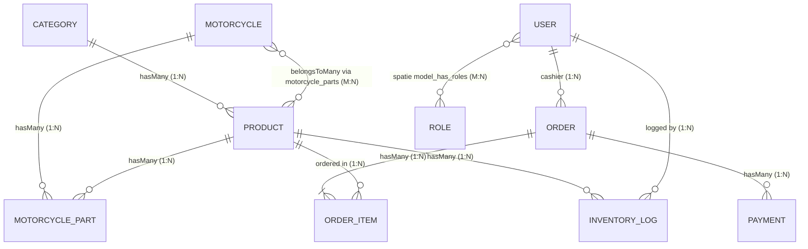

# Database Relationships & Entity Architecture

Dokumen ini memuat arsitektur relasi database lengkap di dalam sistem **Motorku (Toko Sparepart & POS)**, termasuk rincian relasi **Many-to-Many** pada fitur **Mapping Massal Sparepart**.

---

## 1. Diagram Relasi Entitas (ERD)



---

## 2. Rincian Khusus: Relasi Mapping Massal Sparepart (Fitment Engine)

Relasi antara model **`Motorcycle`** dan **`Product` (Sparepart)** adalah **Many-to-Many (`BelongsToMany`)** dengan tabel pivot perantara **`motorcycle_parts`**.

### Struktur Pivot: `motorcycle_parts`
Tabel `motorcycle_parts` berfungsi sebagai *rich intermediate entity* (memiliki kolom atribut sendiri):
- `id` (UUID PK)
- `motorcycle_id` (UUID FK -> `motorcycles.id`, on delete cascade)
- `product_id` (UUID FK -> `products.id`, on delete cascade)
- `part_category` (Enum string, e.g., `oli_mesin`, `ban_depan`, `kampas_rem_depan`, `roller`, dsb.)
- `notes` (Nullable string, catatan kompatibilitas spesifik)
- `is_recommended` (Boolean, penanda part OEM / rekomendasi utama)
- `created_at`, `updated_at`, `deleted_at` (SoftDeletes)

### Definisi di Eloquent Model:

```php
// app/Models/Motorcycle.php
public function products(): BelongsToMany
{
    return $this->belongsToMany(Product::class, 'motorcycle_parts')
        ->withPivot('part_category', 'notes', 'is_recommended')
        ->withTimestamps();
}

public function parts(): HasMany
{
    return $this->hasMany(MotorcyclePart::class);
}
```

```php
// app/Models/Product.php
public function motorcycles(): BelongsToMany
{
    return $this->belongsToMany(Motorcycle::class, 'motorcycle_parts')
        ->withPivot('part_category', 'notes', 'is_recommended')
        ->withTimestamps();
}
```

```php
// app/Models/MotorcyclePart.php (Pivot Model)
public function motorcycle(): BelongsTo
{
    return $this->belongsTo(Motorcycle::class);
}

public function product(): BelongsTo
{
    return $this->belongsTo(Product::class);
}
```

---

## 3. Matriks Seluruh Relasi Database di Motorku

| No | Model Asal | Jenis Relasi | Model Target | Foreign Key / Pivot | Keterangan |
|---|---|---|---|---|---|
| **1** | `Motorcycle` | **Many-to-Many** (`BelongsToMany`) | `Product` | Pivot: `motorcycle_parts` (`motorcycle_id`, `product_id`) | Menghubungkan 1 model motor ke banyak sparepart dan sebaliknya |
| **2** | `Motorcycle` | **One-to-Many** (`HasMany`) | `MotorcyclePart` | `motorcycle_parts.motorcycle_id` | Mengakses baris detail mapping sparepart pada motor ini |
| **3** | `Product` | **Many-to-Many** (`BelongsToMany`) | `Motorcycle` | Pivot: `motorcycle_parts` (`product_id`, `motorcycle_id`) | Daftar motor yang kompatibel dengan sparepart ini |
| **4** | `Product` | **Many-to-One** (`BelongsTo`) | `Category` | `products.category_id` | 1 Produk masuk dalam 1 Kategori Katalog utama |
| **5** | `Category` | **One-to-Many** (`HasMany`) | `Product` | `products.category_id` | 1 Kategori memiliki banyak produk katalog |
| **6** | `MotorcyclePart` | **Many-to-One** (`BelongsTo`) | `Motorcycle` | `motorcycle_parts.motorcycle_id` | Relasi balik entitas perantara ke data motor |
| **7** | `MotorcyclePart` | **Many-to-One** (`BelongsTo`) | `Product` | `motorcycle_parts.product_id` | Relasi balik entitas perantara ke produk sparepart |
| **8** | `Order` | **Many-to-One** (`BelongsTo`) | `User` | `orders.cashier_id` | Kasir/Staf yang melayani pesanan transaksi |
| **9** | `Order` | **One-to-Many** (`HasMany`) | `OrderItem` | `order_items.order_id` | Rincian item produk yang dibeli dalam transaksi |
| **10** | `Order` | **One-to-Many** (`HasMany`) | `Payment` | `payments.order_id` | Catatan pembayaran pesanan (Tunai, QRIS, Transfer) |
| **11** | `OrderItem` | **Many-to-One** (`BelongsTo`) | `Order` | `order_items.order_id` | Menunjuk ke nota transaksi induk |
| **12** | `OrderItem` | **Many-to-One** (`BelongsTo`) | `Product` | `order_items.product_id` | Snapshot sparepart yang terjual |
| **13** | `Payment` | **Many-to-One** (`BelongsTo`) | `Order` | `payments.order_id` | Transaksi pembayaran untuk order terkait |
| **14** | `InventoryLog` | **Many-to-One** (`BelongsTo`) | `Product` | `inventory_logs.product_id` | Log audit mutasi stok masuk/keluar/koreksi |
| **15** | `InventoryLog` | **Many-to-One** (`BelongsTo`) | `User` | `inventory_logs.user_id` | User yang melakukan penyesuaian inventori |
| **16** | `User` | **Many-to-Many** (`BelongsToMany`) | `Role` / `Permission` | Spatie table: `model_has_roles` | Peran pengguna (`owner`, `manager`, `cashier`) |

---

## 4. Keuntungan Arsitektur Many-to-Many untuk Toko Sparepart

1. **Efisiensi Database (Zero Duplication)**:
   - Satu item produk (misalnya *Oli MPX2 0.8L* atau *Busi CPR9EA-9*) hanya dibuat **satu kali** di tabel `products`.
   - Produk tersebut dapat dimapping ke **puluhan atau ratusan model motor** tanpa menduplikasi data master.
2. **Pencarian Cepat di POS & Fitment Engine ("Motor Saya")**:
   - Ketika pelanggan menyebutkan jenis motornya (*misal: Beat Street 2021*), sistem dapat langsung mengambil seluruh sparepart yang cocok via query:
     `$motorcycle->products()->wherePivot('part_category', 'oli_mesin')->get();`
3. **Fleksibilitas Rekomendasi & Catatan Khusus**:
   - Menggunakan kolom pivot `is_recommended` dan `notes`, sistem dapat memberikan rekomendasi part terbaik (*OEM / Racing*) serta catatan pemasangan (*misal: Khusus Varian Non-ABS*).
