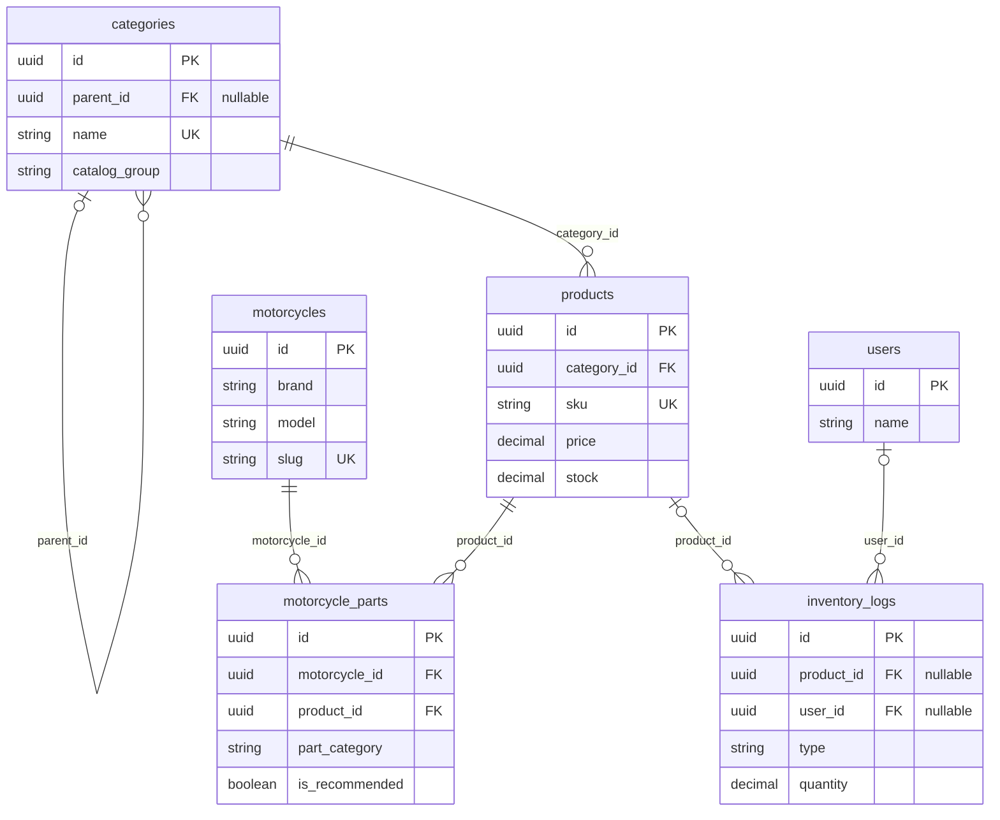
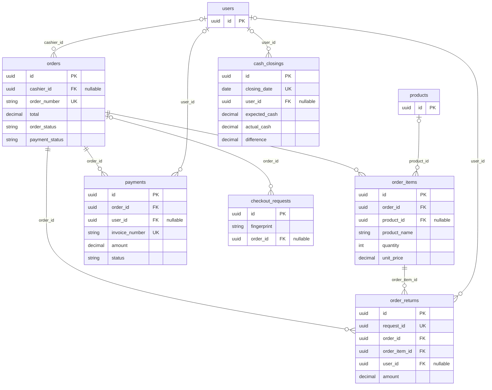
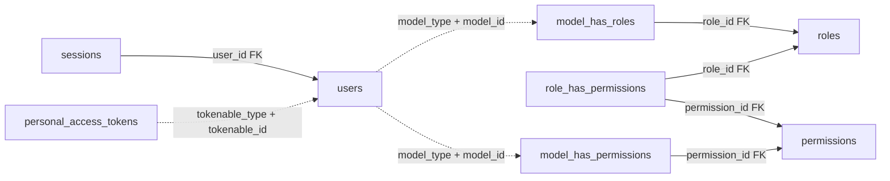

# Schema database Motorku

Database: **MySQL `sparepart`**. Struktur dibaca langsung dari database lokal pada **6 Oktober 2026**, lalu kegunaannya dicocokkan dengan model, service, route dan konfigurasi aplikasi. Terdapat **29 tabel, 233 kolom, dan 21 foreign key**. Ini adalah snapshot struktur; bukan salinan isi transaksi atau data akun.

## Cara membaca

- **PK / primary key**: identitas unik baris.
- **FK / foreign key**: hubungan yang ditegakkan database ke tabel lain.
- **Unique**: nilai atau kombinasi kolom tidak boleh berulang.
- **Nullable**: kolom boleh kosong (`NULL`).
- Dalam diagram ERD, `||` berarti tepat satu, `|o` berarti nol atau satu, dan `o{` berarti nol atau banyak. Identitas bisnis biasanya UUID `char(36)`; tabel framework tidak semuanya memakai UUID.
- `users` adalah akun owner/kasir, bukan daftar pelanggan. Data nama/telepon pelanggan disimpan pada `orders`.

## 1. Kegunaan semua tabel

### Katalog dan kecocokan motor

| Tabel | Kegunaan |
|---|---|
| `categories` | Kategori dan subkategori barang. `parent_id` menunjuk kategori induk; `catalog_group` memisahkan Otomotif, Elektronik, Alat Bangunan dan Sepeda. |
| `products` | Master semua barang yang dijual: SKU, nama, harga jual/modal, stok, satuan, lokasi rak, gambar dan status tersedia di POS. Semua kelompok toko memakai tabel ini. |
| `motorcycles` | Master model motor: merek, model, tahun, kapasitas mesin, jenis motor dan gambar. Dipakai oleh Data Motor dan Motor Saya. |
| `motorcycle_parts` | Penghubung motor dengan produk yang cocok, termasuk jenis part, catatan dan rekomendasi. Ini tidak menyimpan stok baru; stok tetap milik `products`. |

### Penjualan, stok dan kas

| Tabel | Kegunaan |
|---|---|
| `orders` | Kepala nota/pesanan: nomor order, pelanggan, kasir, subtotal, diskon, pajak, total, status pesanan/pembayaran dan batas kedaluwarsa. Token pelanggan mengizinkan akses ke pesanan online tanpa akun staf. |
| `order_items` | Baris barang pada nota: jumlah, nama/SKU saat dibeli, harga saat transaksi, diskon, subtotal dan catatan. Snapshot tetap menyimpan rincian penjualan walau master produk berubah atau dihapus. |
| `payments` | Catatan pembayaran atau percobaannya: metode, nominal, uang diterima, kembalian, nomor invoice/referensi, petugas, status dan waktu pembayaran. Satu order bisa memiliki beberapa catatan pembayaran, termasuk percobaan yang gagal/dibatalkan. |
| `order_returns` | Retur barang dan pengembalian uang: item asal, jumlah, nominal, metode/referensi refund, alasan, petugas dan apakah stok dikembalikan. `request_id` unik mencegah retur yang sama tercatat dua kali. |
| `inventory_logs` | Riwayat perubahan stok: masuk, keluar, koreksi dan retur; menyimpan jumlah, stok sebelum/sesudah, petugas dan referensi penyebab perubahan. Ini riwayat mutasi, sedangkan saldo stok saat ini ada di `products.stock`. |
| `cash_closings` | Rekap tutup kas per tanggal: uang awal, penjualan/retur tunai, pengeluaran, uang yang seharusnya ada, hitungan fisik, selisih dan petugas. Satu rekap per tanggal. |
| `cash_day_locks` | Satu baris pengunci per tanggal untuk menyelaraskan pembayaran/retur tunai dengan tutup kas saat request bersamaan. Tanggal yang ada di sini belum tentu sudah ditutup; status tutup ditentukan oleh `cash_closings`. |
| `checkout_requests` | Identitas request checkout dan hash payload/konteksnya. Pengiriman ulang ID yang sama mengembalikan order yang sama, sehingga transaksi tidak dibuat ganda. Hash `fingerprint` bukan sidik jari manusia. |
| `document_sequences` | Nomor urut terakhir per jenis dokumen dan tanggal. Membantu menghasilkan nomor `ORD-YYYYMMDD-XXXX` / `INV-YYYYMMDD-XXXX` secara aman dan tidak memakai ulang urutan setelah penghapusan dokumen. |

### Akun, sesi dan hak akses

| Tabel | Kegunaan |
|---|---|
| `users` | Akun staf/owner: nama, email, hash password, avatar dan status aktif. Role dipasang melalui tabel penghubung, bukan kolom role di tabel ini. |
| `roles` | Master peran akses. Alur aplikasi saat ini menggunakan `owner` dan `cashier`. |
| `permissions` | Master izin tindakan, misalnya melihat produk atau mengelola kategori. Sebagian endpoint juga dibatasi langsung berdasarkan role. |
| `model_has_roles` | Penghubung akun/model ke role. Satu akun bisa mendapat beberapa role. `model_type` + `model_id` menunjuk model, biasanya `App\Models\User`. |
| `role_has_permissions` | Penghubung role ke izin. Misalnya role kasir memperoleh izin membaca katalog dan menjalankan transaksi. |
| `model_has_permissions` | Izin yang diberikan langsung ke akun/model di luar pemberian lewat role. Disediakan Spatie; tidak mempunyai menu khusus pemberian izin langsung pada UI staf saat ini. |
| `sessions` | Sesi login/browser: identitas sesi, akun, IP, user agent, payload sesi dan aktivitas terakhir. Sesi biasa tetap digunakan setelah fitur Ingat saya dihapus. |
| `personal_access_tokens` | Token API Laravel Sanctum untuk model/akun, lengkap dengan kemampuan dan waktu kedaluwarsa. Alur admin web saat ini memakai sesi; tidak ada menu pembuatan token API pada UI. |
| `password_reset_tokens` | Tabel bawaan untuk token reset password melalui email. **Sudah tidak digunakan oleh alur aplikasi** setelah fitur Lupa password beserta endpointnya dihapus; tabel lama masih ada di database. |

### Pengaturan dan tabel sistem Laravel

| Tabel | Kegunaan |
|---|---|
| `settings` | Nilai pengaturan berdasarkan grup/key/type: identitas toko, tagline, gambar, pemesanan QR, zona waktu, pajak, sesi dan printer. |
| `cache` | Penyimpanan sementara untuk hasil yang dapat dipakai ulang, misalnya pengaturan dan data kompatibilitas motor, beserta waktu kedaluwarsa. Bukan master produk/transaksi. |
| `cache_locks` | Pengunci sementara milik mekanisme cache Laravel, dengan pemilik dan masa berlaku. Berbeda dari penguncian hari kas pada `cash_day_locks`. |
| `jobs` | Antrean pekerjaan background yang akan atau sedang diproses worker. Menyimpan payload, jumlah percobaan dan waktu ketersediaan; bukan daftar pesanan pembeli. |
| `job_batches` | Rekap sekelompok pekerjaan background: jumlah total, pending, gagal dan kapan selesai. Infrastruktur batching Laravel; belum ditemukan pemanggilan `Bus::batch` dalam kode aplikasi saat ini. |
| `failed_jobs` | Catatan pekerjaan background yang gagal, termasuk exception untuk diagnosis dan retry. Keberadaan tabel ini tidak berarti transaksi pembeli gagal. |
| `migrations` | Daftar perubahan struktur database yang sudah dijalankan Laravel, beserta batch-nya. Bukan data bisnis dan bukan definisi schema itu sendiri. |

Konfigurasi lokal yang diperiksa menggunakan driver **database** untuk cache, sesi dan queue. Karena itu tabel teknis tersebut memang merupakan bagian dari konfigurasi Laravel, walaupun beberapa fitur seperti batch job tidak dipanggil oleh kode saat ini.

## 2. Diagram relasi katalog dan stok

```mermaid
erDiagram
    categories |o--o{ categories : parent_id
    categories ||--o{ products : category_id
    motorcycles ||--o{ motorcycle_parts : motorcycle_id
    products ||--o{ motorcycle_parts : product_id
    products |o--o{ inventory_logs : product_id
    users |o--o{ inventory_logs : user_id

    categories {
        uuid id PK
        uuid parent_id FK "nullable"
        string name UK
        string catalog_group
    }
    products {
        uuid id PK
        uuid category_id FK
        string sku UK
        decimal price
        decimal stock
    }
    motorcycles {
        uuid id PK
        string brand
        string model
        string slug UK
    }
    motorcycle_parts {
        uuid id PK
        uuid motorcycle_id FK
        uuid product_id FK
        string part_category
        boolean is_recommended
    }
    inventory_logs {
        uuid id PK
        uuid product_id FK "nullable"
        uuid user_id FK "nullable"
        string type
        decimal quantity
    }
    users {
        uuid id PK
        string name
    }
```

**Contoh ilustrasi:** satu produk oli dapat cocok untuk banyak model motor melalui `motorcycle_parts`; produk dan stoknya tetap satu. Barang elektronik atau alat bangunan dapat dijual dari `products` tanpa mapping motor.

## 3. Diagram relasi transaksi dan kas

```mermaid
erDiagram
    users |o--o{ orders : cashier_id
    orders ||--o{ order_items : order_id
    products |o--o{ order_items : product_id
    orders ||--o{ payments : order_id
    users |o--o{ payments : user_id
    orders ||--o{ order_returns : order_id
    order_items ||--o{ order_returns : order_item_id
    users |o--o{ order_returns : user_id
    users |o--o{ cash_closings : user_id
    orders |o--o{ checkout_requests : order_id

    orders {
        uuid id PK
        uuid cashier_id FK "nullable"
        string order_number UK
        decimal total
        string order_status
        string payment_status
    }
    order_items {
        uuid id PK
        uuid order_id FK
        uuid product_id FK "nullable"
        string product_name
        int quantity
        decimal unit_price
    }
    payments {
        uuid id PK
        uuid order_id FK
        uuid user_id FK "nullable"
        string invoice_number UK
        decimal amount
        string status
    }
    order_returns {
        uuid id PK
        uuid request_id UK
        uuid order_id FK
        uuid order_item_id FK
        uuid user_id FK "nullable"
        decimal amount
    }
    cash_closings {
        uuid id PK
        date closing_date UK
        uuid user_id FK "nullable"
        decimal expected_cash
        decimal actual_cash
        decimal difference
    }
    checkout_requests {
        uuid id PK
        string fingerprint
        uuid order_id FK "nullable"
    }
    products {
        uuid id PK
    }
    users {
        uuid id PK
    }
```

Alurnya: checkout menghasilkan `orders` dan `order_items`; pembayaran dicatat pada `payments`; perubahan persediaan dicatat pada `inventory_logs`. Retur mengacu ke nota dan item asal. Rekap kas menghitung pembayaran/retur tunai berdasarkan tanggal; **tidak ada FK langsung dari `cash_closings` ke tiap payment/retur**. `cash_day_locks` dan `document_sequences` juga tidak mempunyai FK; keduanya dipakai service untuk penguncian dan penomoran.

## 4. Diagram akun dan hak akses

```mermaid
flowchart LR
    users[users] -. "model_type + model_id" .-> model_has_roles[model_has_roles]
    model_has_roles -->|role_id FK| roles[roles]
    role_has_permissions[role_has_permissions] -->|role_id FK| roles
    role_has_permissions -->|permission_id FK| permissions[permissions]
    users -. "model_type + model_id" .-> model_has_permissions[model_has_permissions]
    model_has_permissions -->|permission_id FK| permissions
    sessions[sessions] -->|user_id FK| users
    personal_access_tokens[personal_access_tokens] -. "tokenable_type + tokenable_id" .-> users
```

Garis penuh pada diagram ini adalah FK database. Garis putus-putus adalah hubungan melalui pasangan tipe model dan ID, yang diatur Laravel/Spatie; **bukan FK ke `users` di MySQL**. `inventory_logs.reference_type` + `reference_id` juga menyimpan referensi jenis dokumen/ID melalui kode aplikasi, misalnya order atau retur, tanpa FK database.

## 5. Catatan penting untuk project ini

- Core model memakai **hard delete**; database lokal yang dibaca tidak memiliki kolom `deleted_at`. Snapshot item nota dan nama produk pada log persediaan disediakan agar riwayat tetap terbaca setelah master produk dihapus.
- `SET NULL` berarti baris riwayat tetap ada tetapi hubungan ke entitas yang dihapus menjadi kosong. `CASCADE` menghapus baris anak ketika induknya dihapus. `RESTRICT` menolak penghapusan induk selama masih dirujuk. Pemeriksaan business rule pada service dapat lebih ketat daripada FK, misalnya melindungi pesanan yang sudah dibayar dan produk dalam pesanan aktif.
- Penghapusan motor/produk menghapus mapping `motorcycle_parts`. Kategori yang masih memiliki produk/anak tidak bisa langsung dihapus lewat aplikasi. Baris retur mencegah penghapusan nota/item asal melalui FK `RESTRICT`.
- `users.remember_token` masih ada sebagai kolom schema lama, tetapi autentikasi Ingat saya sudah dinonaktifkan. `password_reset_tokens` juga masih ada secara fisik meski fitur reset email telah dihapus. Menonaktifkan fitur tidak otomatis menjalankan migrasi penghapusan tabel/kolom.
- `sync_version` tersedia di beberapa tabel sebagai penanda versi; keberadaannya belum berarti offline sync sudah diimplementasikan.
- Tidak ada tabel pelanggan terpisah, juga tidak ada tabel transaksi/stok terpisah untuk Elektronik, Alat Bangunan atau Sepeda. Pemisahan kelompok dilakukan lewat kategori.
- Migrasi hard delete `2026_10_05_000001_use_permanent_deletes` menghapus baris legacy bertanda `deleted_at` dan kolomnya. Penerapannya membutuhkan backup; rollback schema tidak mengembalikan data yang sudah dihapus. Preflight menolak relasi legacy yang berisiko kehilangan data aktif/retur. Catatan ini tetap berlaku untuk instalasi lain yang belum menjalankan migrasi tersebut.

## 6. Kamus struktur lengkap

Daftar berikut memuat semua kolom, primary key, foreign key, nullable dan index dari metadata MySQL lokal. Nilai `NULL` pada kolom default berarti tidak ada nilai default non-null yang tercatat; itu berbeda dari status nullable. Jenis kolom pada diagram di atas diringkas, sedangkan jenis MySQL sebenarnya ada di bawah.

### `cache`

| Kolom | Tipe MySQL | Nullable | Kunci / hubungan | Default |
|---|---|---|---|---|
| `key` | `varchar(255)` | Tidak | PK | NULL / tidak ditetapkan |
| `value` | `mediumtext` | Tidak | - | NULL / tidak ditetapkan |
| `expiration` | `int` | Tidak | - | NULL / tidak ditetapkan |

**Index:**

- INDEX `cache_expiration_index`: `expiration`.
- PRIMARY KEY `PRIMARY`: `key`.

Tidak mempunyai foreign key database.

### `cache_locks`

| Kolom | Tipe MySQL | Nullable | Kunci / hubungan | Default |
|---|---|---|---|---|
| `key` | `varchar(255)` | Tidak | PK | NULL / tidak ditetapkan |
| `owner` | `varchar(255)` | Tidak | - | NULL / tidak ditetapkan |
| `expiration` | `int` | Tidak | - | NULL / tidak ditetapkan |

**Index:**

- INDEX `cache_locks_expiration_index`: `expiration`.
- PRIMARY KEY `PRIMARY`: `key`.

Tidak mempunyai foreign key database.

### `cash_closings`

| Kolom | Tipe MySQL | Nullable | Kunci / hubungan | Default |
|---|---|---|---|---|
| `id` | `char(36)` | Tidak | PK | NULL / tidak ditetapkan |
| `closing_date` | `date` | Tidak | UNIQUE | NULL / tidak ditetapkan |
| `opening_cash` | `decimal(15,2)` | Tidak | - | NULL / tidak ditetapkan |
| `cash_out` | `decimal(15,2)` | Tidak | - | NULL / tidak ditetapkan |
| `cash_sales` | `decimal(15,2)` | Tidak | - | NULL / tidak ditetapkan |
| `cash_returns` | `decimal(15,2)` | Tidak | - | NULL / tidak ditetapkan |
| `expected_cash` | `decimal(15,2)` | Tidak | - | NULL / tidak ditetapkan |
| `actual_cash` | `decimal(15,2)` | Tidak | - | NULL / tidak ditetapkan |
| `difference` | `decimal(15,2)` | Tidak | - | NULL / tidak ditetapkan |
| `notes` | `varchar(255)` | Ya | - | NULL / tidak ditetapkan |
| `user_id` | `char(36)` | Ya | FK `users.id` | NULL / tidak ditetapkan |
| `created_at` | `timestamp` | Ya | - | NULL / tidak ditetapkan |
| `updated_at` | `timestamp` | Ya | - | NULL / tidak ditetapkan |

**Index:**

- UNIQUE `cash_closings_closing_date_unique`: `closing_date`.
- INDEX `cash_closings_user_id_foreign`: `user_id`.
- PRIMARY KEY `PRIMARY`: `id`.

**Aturan FK:**

- `user_id` -> `users.id`; ON DELETE `SET NULL`, ON UPDATE `NO ACTION`.

### `cash_day_locks`

| Kolom | Tipe MySQL | Nullable | Kunci / hubungan | Default |
|---|---|---|---|---|
| `business_date` | `date` | Tidak | PK | NULL / tidak ditetapkan |

**Index:**

- PRIMARY KEY `PRIMARY`: `business_date`.

Tidak mempunyai foreign key database.

### `categories`

| Kolom | Tipe MySQL | Nullable | Kunci / hubungan | Default |
|---|---|---|---|---|
| `id` | `char(36)` | Tidak | PK | NULL / tidak ditetapkan |
| `parent_id` | `char(36)` | Ya | FK `categories.id` | NULL / tidak ditetapkan |
| `name` | `varchar(255)` | Tidak | UNIQUE | NULL / tidak ditetapkan |
| `description` | `text` | Ya | - | NULL / tidak ditetapkan |
| `sync_version` | `bigint unsigned` | Tidak | - | `1` |
| `created_at` | `timestamp` | Ya | - | NULL / tidak ditetapkan |
| `updated_at` | `timestamp` | Ya | - | NULL / tidak ditetapkan |
| `catalog_group` | `varchar(255)` | Tidak | - | `automotive` |

**Index:**

- INDEX `categories_catalog_group_index`: `catalog_group`.
- UNIQUE `categories_name_unique`: `name`.
- INDEX `categories_parent_id_foreign`: `parent_id`.
- INDEX `categories_sync_version_index`: `sync_version`.
- PRIMARY KEY `PRIMARY`: `id`.

**Aturan FK:**

- `parent_id` -> `categories.id`; ON DELETE `SET NULL`, ON UPDATE `NO ACTION`.

### `checkout_requests`

| Kolom | Tipe MySQL | Nullable | Kunci / hubungan | Default |
|---|---|---|---|---|
| `id` | `char(36)` | Tidak | PK | NULL / tidak ditetapkan |
| `fingerprint` | `char(64)` | Tidak | - | NULL / tidak ditetapkan |
| `order_id` | `char(36)` | Ya | FK `orders.id` | NULL / tidak ditetapkan |
| `created_at` | `timestamp` | Ya | - | NULL / tidak ditetapkan |
| `updated_at` | `timestamp` | Ya | - | NULL / tidak ditetapkan |

**Index:**

- INDEX `checkout_requests_order_id_foreign`: `order_id`.
- PRIMARY KEY `PRIMARY`: `id`.

**Aturan FK:**

- `order_id` -> `orders.id`; ON DELETE `SET NULL`, ON UPDATE `NO ACTION`.

### `document_sequences`

| Kolom | Tipe MySQL | Nullable | Kunci / hubungan | Default |
|---|---|---|---|---|
| `type` | `varchar(16)` | Tidak | PK | NULL / tidak ditetapkan |
| `sequence_date` | `date` | Tidak | PK | NULL / tidak ditetapkan |
| `last_number` | `bigint unsigned` | Tidak | - | `0` |

**Index:**

- PRIMARY KEY `PRIMARY`: `type`, `sequence_date`.

Tidak mempunyai foreign key database.

### `failed_jobs`

| Kolom | Tipe MySQL | Nullable | Kunci / hubungan | Default |
|---|---|---|---|---|
| `id` | `bigint unsigned` | Tidak | PK; AUTO_INCREMENT | NULL / tidak ditetapkan |
| `uuid` | `varchar(255)` | Tidak | UNIQUE | NULL / tidak ditetapkan |
| `connection` | `text` | Tidak | - | NULL / tidak ditetapkan |
| `queue` | `text` | Tidak | - | NULL / tidak ditetapkan |
| `payload` | `longtext` | Tidak | - | NULL / tidak ditetapkan |
| `exception` | `longtext` | Tidak | - | NULL / tidak ditetapkan |
| `failed_at` | `timestamp` | Tidak | - | `CURRENT_TIMESTAMP` |

**Index:**

- UNIQUE `failed_jobs_uuid_unique`: `uuid`.
- PRIMARY KEY `PRIMARY`: `id`.

Tidak mempunyai foreign key database.

### `inventory_logs`

| Kolom | Tipe MySQL | Nullable | Kunci / hubungan | Default |
|---|---|---|---|---|
| `id` | `char(36)` | Tidak | PK | NULL / tidak ditetapkan |
| `product_id` | `char(36)` | Ya | FK `products.id` | NULL / tidak ditetapkan |
| `user_id` | `char(36)` | Ya | FK `users.id` | NULL / tidak ditetapkan |
| `type` | `enum('stock_in','stock_out','adjustment','stock_return')` | Tidak | - | NULL / tidak ditetapkan |
| `quantity` | `decimal(10,2)` | Tidak | - | NULL / tidak ditetapkan |
| `previous_stock` | `decimal(10,2)` | Ya | - | NULL / tidak ditetapkan |
| `new_stock` | `decimal(10,2)` | Ya | - | NULL / tidak ditetapkan |
| `reference_type` | `varchar(255)` | Ya | - | NULL / tidak ditetapkan |
| `reference_id` | `char(36)` | Ya | - | NULL / tidak ditetapkan |
| `note` | `text` | Ya | - | NULL / tidak ditetapkan |
| `sync_version` | `bigint unsigned` | Tidak | - | `1` |
| `created_at` | `timestamp` | Ya | - | NULL / tidak ditetapkan |
| `updated_at` | `timestamp` | Ya | - | NULL / tidak ditetapkan |
| `product_name` | `varchar(255)` | Ya | - | NULL / tidak ditetapkan |

**Index:**

- INDEX `idx_inventory_logs_reference`: `reference_type`, `reference_id`.
- INDEX `inventory_logs_product_id_index`: `product_id`.
- INDEX `inventory_logs_sync_version_index`: `sync_version`.
- INDEX `inventory_logs_type_index`: `type`.
- INDEX `inventory_logs_user_id_index`: `user_id`.
- PRIMARY KEY `PRIMARY`: `id`.

**Aturan FK:**

- `product_id` -> `products.id`; ON DELETE `SET NULL`, ON UPDATE `NO ACTION`.
- `user_id` -> `users.id`; ON DELETE `SET NULL`, ON UPDATE `CASCADE`.

### `job_batches`

| Kolom | Tipe MySQL | Nullable | Kunci / hubungan | Default |
|---|---|---|---|---|
| `id` | `varchar(255)` | Tidak | PK | NULL / tidak ditetapkan |
| `name` | `varchar(255)` | Tidak | - | NULL / tidak ditetapkan |
| `total_jobs` | `int` | Tidak | - | NULL / tidak ditetapkan |
| `pending_jobs` | `int` | Tidak | - | NULL / tidak ditetapkan |
| `failed_jobs` | `int` | Tidak | - | NULL / tidak ditetapkan |
| `failed_job_ids` | `longtext` | Tidak | - | NULL / tidak ditetapkan |
| `options` | `mediumtext` | Ya | - | NULL / tidak ditetapkan |
| `cancelled_at` | `int` | Ya | - | NULL / tidak ditetapkan |
| `created_at` | `int` | Tidak | - | NULL / tidak ditetapkan |
| `finished_at` | `int` | Ya | - | NULL / tidak ditetapkan |

**Index:**

- PRIMARY KEY `PRIMARY`: `id`.

Tidak mempunyai foreign key database.

### `jobs`

| Kolom | Tipe MySQL | Nullable | Kunci / hubungan | Default |
|---|---|---|---|---|
| `id` | `bigint unsigned` | Tidak | PK; AUTO_INCREMENT | NULL / tidak ditetapkan |
| `queue` | `varchar(255)` | Tidak | - | NULL / tidak ditetapkan |
| `payload` | `longtext` | Tidak | - | NULL / tidak ditetapkan |
| `attempts` | `tinyint unsigned` | Tidak | - | NULL / tidak ditetapkan |
| `reserved_at` | `int unsigned` | Ya | - | NULL / tidak ditetapkan |
| `available_at` | `int unsigned` | Tidak | - | NULL / tidak ditetapkan |
| `created_at` | `int unsigned` | Tidak | - | NULL / tidak ditetapkan |

**Index:**

- INDEX `jobs_queue_index`: `queue`.
- PRIMARY KEY `PRIMARY`: `id`.

Tidak mempunyai foreign key database.

### `migrations`

| Kolom | Tipe MySQL | Nullable | Kunci / hubungan | Default |
|---|---|---|---|---|
| `id` | `int unsigned` | Tidak | PK; AUTO_INCREMENT | NULL / tidak ditetapkan |
| `migration` | `varchar(255)` | Tidak | - | NULL / tidak ditetapkan |
| `batch` | `int` | Tidak | - | NULL / tidak ditetapkan |

**Index:**

- PRIMARY KEY `PRIMARY`: `id`.

Tidak mempunyai foreign key database.

### `model_has_permissions`

| Kolom | Tipe MySQL | Nullable | Kunci / hubungan | Default |
|---|---|---|---|---|
| `permission_id` | `bigint unsigned` | Tidak | PK; FK `permissions.id` | NULL / tidak ditetapkan |
| `model_type` | `varchar(255)` | Tidak | PK | NULL / tidak ditetapkan |
| `model_id` | `char(36)` | Tidak | PK | NULL / tidak ditetapkan |

**Index:**

- INDEX `model_has_permissions_model_id_model_type_index`: `model_id`, `model_type`.
- PRIMARY KEY `PRIMARY`: `permission_id`, `model_id`, `model_type`.

**Aturan FK:**

- `permission_id` -> `permissions.id`; ON DELETE `CASCADE`, ON UPDATE `NO ACTION`.

### `model_has_roles`

| Kolom | Tipe MySQL | Nullable | Kunci / hubungan | Default |
|---|---|---|---|---|
| `role_id` | `bigint unsigned` | Tidak | PK; FK `roles.id` | NULL / tidak ditetapkan |
| `model_type` | `varchar(255)` | Tidak | PK | NULL / tidak ditetapkan |
| `model_id` | `char(36)` | Tidak | PK | NULL / tidak ditetapkan |

**Index:**

- INDEX `model_has_roles_model_id_model_type_index`: `model_id`, `model_type`.
- PRIMARY KEY `PRIMARY`: `role_id`, `model_id`, `model_type`.

**Aturan FK:**

- `role_id` -> `roles.id`; ON DELETE `CASCADE`, ON UPDATE `NO ACTION`.

### `motorcycle_parts`

| Kolom | Tipe MySQL | Nullable | Kunci / hubungan | Default |
|---|---|---|---|---|
| `id` | `char(36)` | Tidak | PK | NULL / tidak ditetapkan |
| `motorcycle_id` | `char(36)` | Tidak | FK `motorcycles.id` | NULL / tidak ditetapkan |
| `product_id` | `char(36)` | Tidak | FK `products.id` | NULL / tidak ditetapkan |
| `part_category` | `varchar(50)` | Tidak | - | NULL / tidak ditetapkan |
| `notes` | `varchar(255)` | Ya | - | NULL / tidak ditetapkan |
| `is_recommended` | `tinyint(1)` | Tidak | - | `0` |
| `created_at` | `timestamp` | Ya | - | NULL / tidak ditetapkan |
| `updated_at` | `timestamp` | Ya | - | NULL / tidak ditetapkan |

**Index:**

- INDEX `idx_mp_recommended_active`: `is_recommended`.
- UNIQUE `motorcycle_parts_motorcycle_id_product_id_unique`: `motorcycle_id`, `product_id`.
- INDEX `motorcycle_parts_part_category_index`: `part_category`.
- INDEX `motorcycle_parts_product_id_foreign`: `product_id`.
- PRIMARY KEY `PRIMARY`: `id`.

**Aturan FK:**

- `motorcycle_id` -> `motorcycles.id`; ON DELETE `CASCADE`, ON UPDATE `NO ACTION`.
- `product_id` -> `products.id`; ON DELETE `CASCADE`, ON UPDATE `NO ACTION`.

### `motorcycles`

| Kolom | Tipe MySQL | Nullable | Kunci / hubungan | Default |
|---|---|---|---|---|
| `id` | `char(36)` | Tidak | PK | NULL / tidak ditetapkan |
| `brand` | `varchar(50)` | Tidak | - | NULL / tidak ditetapkan |
| `model` | `varchar(100)` | Tidak | - | NULL / tidak ditetapkan |
| `slug` | `varchar(120)` | Tidak | UNIQUE | NULL / tidak ditetapkan |
| `year_start` | `int` | Tidak | - | NULL / tidak ditetapkan |
| `year_end` | `int` | Ya | - | NULL / tidak ditetapkan |
| `engine_cc` | `int` | Tidak | - | NULL / tidak ditetapkan |
| `engine_type` | `varchar(20)` | Tidak | - | `matic` |
| `image_url` | `varchar(255)` | Ya | - | NULL / tidak ditetapkan |
| `created_at` | `timestamp` | Ya | - | NULL / tidak ditetapkan |
| `updated_at` | `timestamp` | Ya | - | NULL / tidak ditetapkan |

**Index:**

- INDEX `motorcycles_brand_index`: `brand`.
- UNIQUE `motorcycles_slug_unique`: `slug`.
- PRIMARY KEY `PRIMARY`: `id`.

Tidak mempunyai foreign key database.

### `order_items`

| Kolom | Tipe MySQL | Nullable | Kunci / hubungan | Default |
|---|---|---|---|---|
| `id` | `char(36)` | Tidak | PK | NULL / tidak ditetapkan |
| `order_id` | `char(36)` | Tidak | FK `orders.id` | NULL / tidak ditetapkan |
| `product_id` | `char(36)` | Ya | FK `products.id` | NULL / tidak ditetapkan |
| `product_name` | `varchar(255)` | Tidak | - | NULL / tidak ditetapkan |
| `product_sku` | `varchar(255)` | Tidak | - | NULL / tidak ditetapkan |
| `unit_price` | `decimal(15,2)` | Tidak | - | NULL / tidak ditetapkan |
| `discount_amount` | `decimal(15,2)` | Tidak | - | `0.00` |
| `quantity` | `int unsigned` | Tidak | - | NULL / tidak ditetapkan |
| `subtotal` | `decimal(15,2)` | Tidak | - | NULL / tidak ditetapkan |
| `notes` | `text` | Ya | - | NULL / tidak ditetapkan |
| `sync_version` | `bigint unsigned` | Tidak | - | `1` |
| `created_at` | `timestamp` | Ya | - | NULL / tidak ditetapkan |
| `updated_at` | `timestamp` | Ya | - | NULL / tidak ditetapkan |

**Index:**

- INDEX `order_items_order_id_index`: `order_id`.
- INDEX `order_items_product_id_index`: `product_id`.
- INDEX `order_items_sync_version_index`: `sync_version`.
- PRIMARY KEY `PRIMARY`: `id`.

**Aturan FK:**

- `order_id` -> `orders.id`; ON DELETE `CASCADE`, ON UPDATE `CASCADE`.
- `product_id` -> `products.id`; ON DELETE `SET NULL`, ON UPDATE `CASCADE`.

### `order_returns`

| Kolom | Tipe MySQL | Nullable | Kunci / hubungan | Default |
|---|---|---|---|---|
| `id` | `char(36)` | Tidak | PK | NULL / tidak ditetapkan |
| `request_id` | `char(36)` | Tidak | UNIQUE | NULL / tidak ditetapkan |
| `order_id` | `char(36)` | Tidak | FK `orders.id` | NULL / tidak ditetapkan |
| `order_item_id` | `char(36)` | Tidak | FK `order_items.id` | NULL / tidak ditetapkan |
| `user_id` | `char(36)` | Ya | FK `users.id` | NULL / tidak ditetapkan |
| `quantity` | `int unsigned` | Tidak | - | NULL / tidak ditetapkan |
| `amount` | `decimal(15,2)` | Tidak | - | NULL / tidak ditetapkan |
| `refund_method` | `varchar(20)` | Tidak | - | `cash` |
| `refund_reference` | `varchar(100)` | Ya | - | NULL / tidak ditetapkan |
| `restocked` | `tinyint(1)` | Tidak | - | NULL / tidak ditetapkan |
| `reason` | `varchar(255)` | Ya | - | NULL / tidak ditetapkan |
| `created_at` | `timestamp` | Ya | - | NULL / tidak ditetapkan |
| `updated_at` | `timestamp` | Ya | - | NULL / tidak ditetapkan |

**Index:**

- INDEX `order_returns_order_id_foreign`: `order_id`.
- INDEX `order_returns_order_item_id_created_at_index`: `order_item_id`, `created_at`.
- UNIQUE `order_returns_request_id_unique`: `request_id`.
- INDEX `order_returns_user_id_foreign`: `user_id`.
- PRIMARY KEY `PRIMARY`: `id`.

**Aturan FK:**

- `order_id` -> `orders.id`; ON DELETE `RESTRICT`, ON UPDATE `NO ACTION`.
- `order_item_id` -> `order_items.id`; ON DELETE `RESTRICT`, ON UPDATE `NO ACTION`.
- `user_id` -> `users.id`; ON DELETE `SET NULL`, ON UPDATE `NO ACTION`.

### `orders`

| Kolom | Tipe MySQL | Nullable | Kunci / hubungan | Default |
|---|---|---|---|---|
| `id` | `char(36)` | Tidak | PK | NULL / tidak ditetapkan |
| `cashier_id` | `char(36)` | Ya | FK `users.id` | NULL / tidak ditetapkan |
| `order_number` | `varchar(255)` | Tidak | UNIQUE | NULL / tidak ditetapkan |
| `customer_name` | `varchar(255)` | Ya | - | NULL / tidak ditetapkan |
| `customer_phone` | `varchar(255)` | Ya | - | NULL / tidak ditetapkan |
| `customer_access_token` | `varchar(64)` | Ya | UNIQUE | NULL / tidak ditetapkan |
| `subtotal` | `decimal(15,2)` | Tidak | - | `0.00` |
| `discount_amount` | `decimal(15,2)` | Tidak | - | `0.00` |
| `tax_amount` | `decimal(15,2)` | Tidak | - | `0.00` |
| `total` | `decimal(15,2)` | Tidak | - | `0.00` |
| `notes` | `text` | Ya | - | NULL / tidak ditetapkan |
| `order_status` | `enum('pending','preparing','ready','completed','cancelled')` | Tidak | - | `pending` |
| `payment_status` | `enum('unpaid','partial','paid','refunded')` | Tidak | - | `unpaid` |
| `sync_version` | `bigint unsigned` | Tidak | - | `1` |
| `created_at` | `timestamp` | Ya | - | NULL / tidak ditetapkan |
| `updated_at` | `timestamp` | Ya | - | NULL / tidak ditetapkan |
| `ordered_at` | `timestamp` | Tidak | - | `CURRENT_TIMESTAMP` |
| `expires_at` | `timestamp` | Ya | - | NULL / tidak ditetapkan |

**Index:**

- INDEX `orders_cashier_id_index`: `cashier_id`.
- UNIQUE `orders_customer_access_token_unique`: `customer_access_token`.
- INDEX `orders_expires_at_index`: `expires_at`.
- UNIQUE `orders_order_number_unique`: `order_number`.
- INDEX `orders_order_status_index`: `order_status`.
- INDEX `orders_ordered_at_index`: `ordered_at`.
- INDEX `orders_payment_status_index`: `payment_status`.
- INDEX `orders_sync_version_index`: `sync_version`.
- PRIMARY KEY `PRIMARY`: `id`.

**Aturan FK:**

- `cashier_id` -> `users.id`; ON DELETE `SET NULL`, ON UPDATE `CASCADE`.

### `password_reset_tokens`

| Kolom | Tipe MySQL | Nullable | Kunci / hubungan | Default |
|---|---|---|---|---|
| `email` | `varchar(255)` | Tidak | PK | NULL / tidak ditetapkan |
| `token` | `varchar(255)` | Tidak | - | NULL / tidak ditetapkan |
| `created_at` | `timestamp` | Ya | - | NULL / tidak ditetapkan |

**Index:**

- PRIMARY KEY `PRIMARY`: `email`.

Tidak mempunyai foreign key database.

### `payments`

| Kolom | Tipe MySQL | Nullable | Kunci / hubungan | Default |
|---|---|---|---|---|
| `id` | `char(36)` | Tidak | PK | NULL / tidak ditetapkan |
| `order_id` | `char(36)` | Tidak | FK `orders.id` | NULL / tidak ditetapkan |
| `user_id` | `char(36)` | Ya | FK `users.id` | NULL / tidak ditetapkan |
| `invoice_number` | `varchar(255)` | Tidak | UNIQUE | NULL / tidak ditetapkan |
| `gateway_reference` | `varchar(255)` | Ya | UNIQUE | NULL / tidak ditetapkan |
| `reference_number` | `varchar(100)` | Ya | - | NULL / tidak ditetapkan |
| `payment_channel` | `varchar(255)` | Ya | - | NULL / tidak ditetapkan |
| `amount` | `decimal(15,2)` | Tidak | - | NULL / tidak ditetapkan |
| `amount_received` | `decimal(15,2)` | Ya | - | NULL / tidak ditetapkan |
| `change_amount` | `decimal(15,2)` | Ya | - | NULL / tidak ditetapkan |
| `payment_method` | `varchar(255)` | Tidak | - | NULL / tidak ditetapkan |
| `notes` | `text` | Ya | - | NULL / tidak ditetapkan |
| `status` | `enum('pending','paid','failed','expired','cancelled','refunded')` | Tidak | - | `pending` |
| `paid_at` | `timestamp` | Ya | - | NULL / tidak ditetapkan |
| `expired_at` | `timestamp` | Ya | - | NULL / tidak ditetapkan |
| `raw_response` | `json` | Ya | - | NULL / tidak ditetapkan |
| `sync_version` | `bigint unsigned` | Tidak | - | `1` |
| `created_at` | `timestamp` | Ya | - | NULL / tidak ditetapkan |
| `updated_at` | `timestamp` | Ya | - | NULL / tidak ditetapkan |

**Index:**

- UNIQUE `payments_gateway_reference_unique`: `gateway_reference`.
- UNIQUE `payments_invoice_number_unique`: `invoice_number`.
- INDEX `payments_order_id_index`: `order_id`.
- INDEX `payments_paid_at_index`: `paid_at`.
- INDEX `payments_payment_channel_index`: `payment_channel`.
- INDEX `payments_status_index`: `status`.
- INDEX `payments_sync_version_index`: `sync_version`.
- INDEX `payments_user_id_foreign`: `user_id`.
- PRIMARY KEY `PRIMARY`: `id`.

**Aturan FK:**

- `order_id` -> `orders.id`; ON DELETE `CASCADE`, ON UPDATE `CASCADE`.
- `user_id` -> `users.id`; ON DELETE `SET NULL`, ON UPDATE `NO ACTION`.

### `permissions`

| Kolom | Tipe MySQL | Nullable | Kunci / hubungan | Default |
|---|---|---|---|---|
| `id` | `bigint unsigned` | Tidak | PK; AUTO_INCREMENT | NULL / tidak ditetapkan |
| `name` | `varchar(255)` | Tidak | - | NULL / tidak ditetapkan |
| `guard_name` | `varchar(255)` | Tidak | - | NULL / tidak ditetapkan |
| `created_at` | `timestamp` | Ya | - | NULL / tidak ditetapkan |
| `updated_at` | `timestamp` | Ya | - | NULL / tidak ditetapkan |

**Index:**

- UNIQUE `permissions_name_guard_name_unique`: `name`, `guard_name`.
- PRIMARY KEY `PRIMARY`: `id`.

Tidak mempunyai foreign key database.

### `personal_access_tokens`

| Kolom | Tipe MySQL | Nullable | Kunci / hubungan | Default |
|---|---|---|---|---|
| `id` | `bigint unsigned` | Tidak | PK; AUTO_INCREMENT | NULL / tidak ditetapkan |
| `tokenable_type` | `varchar(255)` | Tidak | - | NULL / tidak ditetapkan |
| `tokenable_id` | `char(36)` | Tidak | - | NULL / tidak ditetapkan |
| `name` | `text` | Tidak | - | NULL / tidak ditetapkan |
| `token` | `varchar(64)` | Tidak | UNIQUE | NULL / tidak ditetapkan |
| `abilities` | `text` | Ya | - | NULL / tidak ditetapkan |
| `last_used_at` | `timestamp` | Ya | - | NULL / tidak ditetapkan |
| `expires_at` | `timestamp` | Ya | - | NULL / tidak ditetapkan |
| `created_at` | `timestamp` | Ya | - | NULL / tidak ditetapkan |
| `updated_at` | `timestamp` | Ya | - | NULL / tidak ditetapkan |

**Index:**

- INDEX `personal_access_tokens_expires_at_index`: `expires_at`.
- UNIQUE `personal_access_tokens_token_unique`: `token`.
- INDEX `personal_access_tokens_tokenable_type_tokenable_id_index`: `tokenable_type`, `tokenable_id`.
- PRIMARY KEY `PRIMARY`: `id`.

Tidak mempunyai foreign key database.

### `products`

| Kolom | Tipe MySQL | Nullable | Kunci / hubungan | Default |
|---|---|---|---|---|
| `id` | `char(36)` | Tidak | PK | NULL / tidak ditetapkan |
| `category_id` | `char(36)` | Tidak | FK `categories.id` | NULL / tidak ditetapkan |
| `sku` | `varchar(255)` | Tidak | UNIQUE | NULL / tidak ditetapkan |
| `barcode` | `varchar(255)` | Ya | - | NULL / tidak ditetapkan |
| `name` | `varchar(255)` | Tidak | - | NULL / tidak ditetapkan |
| `brand` | `varchar(255)` | Ya | - | NULL / tidak ditetapkan |
| `description` | `text` | Ya | - | NULL / tidak ditetapkan |
| `price` | `decimal(15,2)` | Tidak | - | NULL / tidak ditetapkan |
| `cost_price` | `decimal(15,2)` | Ya | - | NULL / tidak ditetapkan |
| `stock` | `decimal(10,2)` | Tidak | - | `0.00` |
| `minimum_stock` | `decimal(10,2)` | Tidak | - | `0.00` |
| `unit` | `varchar(255)` | Tidak | - | `pcs` |
| `rack_location` | `varchar(255)` | Ya | - | NULL / tidak ditetapkan |
| `image_path` | `varchar(255)` | Ya | - | NULL / tidak ditetapkan |
| `is_available` | `tinyint(1)` | Tidak | - | `1` |
| `sync_version` | `bigint unsigned` | Tidak | - | `1` |
| `created_at` | `timestamp` | Ya | - | NULL / tidak ditetapkan |
| `updated_at` | `timestamp` | Ya | - | NULL / tidak ditetapkan |

**Index:**

- PRIMARY KEY `PRIMARY`: `id`.
- INDEX `products_category_id_index`: `category_id`.
- INDEX `products_is_available_index`: `is_available`.
- INDEX `products_name_index`: `name`.
- UNIQUE `products_sku_unique`: `sku`.
- INDEX `products_sync_version_index`: `sync_version`.

**Aturan FK:**

- `category_id` -> `categories.id`; ON DELETE `RESTRICT`, ON UPDATE `CASCADE`.

### `role_has_permissions`

| Kolom | Tipe MySQL | Nullable | Kunci / hubungan | Default |
|---|---|---|---|---|
| `permission_id` | `bigint unsigned` | Tidak | PK; FK `permissions.id` | NULL / tidak ditetapkan |
| `role_id` | `bigint unsigned` | Tidak | PK; FK `roles.id` | NULL / tidak ditetapkan |

**Index:**

- PRIMARY KEY `PRIMARY`: `permission_id`, `role_id`.
- INDEX `role_has_permissions_role_id_foreign`: `role_id`.

**Aturan FK:**

- `permission_id` -> `permissions.id`; ON DELETE `CASCADE`, ON UPDATE `NO ACTION`.
- `role_id` -> `roles.id`; ON DELETE `CASCADE`, ON UPDATE `NO ACTION`.

### `roles`

| Kolom | Tipe MySQL | Nullable | Kunci / hubungan | Default |
|---|---|---|---|---|
| `id` | `bigint unsigned` | Tidak | PK; AUTO_INCREMENT | NULL / tidak ditetapkan |
| `name` | `varchar(255)` | Tidak | - | NULL / tidak ditetapkan |
| `guard_name` | `varchar(255)` | Tidak | - | NULL / tidak ditetapkan |
| `created_at` | `timestamp` | Ya | - | NULL / tidak ditetapkan |
| `updated_at` | `timestamp` | Ya | - | NULL / tidak ditetapkan |

**Index:**

- PRIMARY KEY `PRIMARY`: `id`.
- UNIQUE `roles_name_guard_name_unique`: `name`, `guard_name`.

Tidak mempunyai foreign key database.

### `sessions`

| Kolom | Tipe MySQL | Nullable | Kunci / hubungan | Default |
|---|---|---|---|---|
| `id` | `varchar(255)` | Tidak | PK | NULL / tidak ditetapkan |
| `user_id` | `char(36)` | Ya | FK `users.id` | NULL / tidak ditetapkan |
| `ip_address` | `varchar(45)` | Ya | - | NULL / tidak ditetapkan |
| `user_agent` | `text` | Ya | - | NULL / tidak ditetapkan |
| `payload` | `longtext` | Tidak | - | NULL / tidak ditetapkan |
| `last_activity` | `int` | Tidak | - | NULL / tidak ditetapkan |

**Index:**

- PRIMARY KEY `PRIMARY`: `id`.
- INDEX `sessions_last_activity_index`: `last_activity`.
- INDEX `sessions_user_id_foreign`: `user_id`.

**Aturan FK:**

- `user_id` -> `users.id`; ON DELETE `SET NULL`, ON UPDATE `NO ACTION`.

### `settings`

| Kolom | Tipe MySQL | Nullable | Kunci / hubungan | Default |
|---|---|---|---|---|
| `id` | `char(36)` | Tidak | PK | NULL / tidak ditetapkan |
| `group` | `varchar(255)` | Tidak | - | NULL / tidak ditetapkan |
| `key` | `varchar(255)` | Tidak | - | NULL / tidak ditetapkan |
| `value` | `text` | Ya | - | NULL / tidak ditetapkan |
| `type` | `enum('string','integer','decimal','boolean','json')` | Tidak | - | `string` |
| `sync_version` | `bigint unsigned` | Tidak | - | `1` |
| `created_at` | `timestamp` | Ya | - | NULL / tidak ditetapkan |
| `updated_at` | `timestamp` | Ya | - | NULL / tidak ditetapkan |

**Index:**

- PRIMARY KEY `PRIMARY`: `id`.
- INDEX `settings_group_index`: `group`.
- UNIQUE `settings_group_key_unique`: `group`, `key`.
- INDEX `settings_sync_version_index`: `sync_version`.

Tidak mempunyai foreign key database.

### `users`

| Kolom | Tipe MySQL | Nullable | Kunci / hubungan | Default |
|---|---|---|---|---|
| `id` | `char(36)` | Tidak | PK | NULL / tidak ditetapkan |
| `name` | `varchar(255)` | Tidak | - | NULL / tidak ditetapkan |
| `email` | `varchar(255)` | Tidak | UNIQUE | NULL / tidak ditetapkan |
| `email_verified_at` | `timestamp` | Ya | - | NULL / tidak ditetapkan |
| `password` | `varchar(255)` | Tidak | - | NULL / tidak ditetapkan |
| `avatar` | `varchar(255)` | Ya | - | NULL / tidak ditetapkan |
| `remember_token` | `varchar(100)` | Ya | - | NULL / tidak ditetapkan |
| `is_active` | `tinyint(1)` | Tidak | - | `1` |
| `sync_version` | `bigint unsigned` | Tidak | - | `1` |
| `created_at` | `timestamp` | Ya | - | NULL / tidak ditetapkan |
| `updated_at` | `timestamp` | Ya | - | NULL / tidak ditetapkan |

**Index:**

- PRIMARY KEY `PRIMARY`: `id`.
- UNIQUE `users_email_unique`: `email`.
- INDEX `users_is_active_index`: `is_active`.
- INDEX `users_sync_version_index`: `sync_version`.

Tidak mempunyai foreign key database.

## 7. Sumber verifikasi

- Metadata `information_schema.TABLES`, `COLUMNS`, `STATISTICS`, `KEY_COLUMN_USAGE`, dan `REFERENTIAL_CONSTRAINTS` pada database lokal `sparepart`.
- Model: [app/Models](D:/Project/Webs/Motorku/app/Models). Alur penjualan: [OrderService.php](D:/Project/Webs/Motorku/app/Services/OrderService.php), [PaymentService.php](D:/Project/Webs/Motorku/app/Services/PaymentService.php), [OrderReturnService.php](D:/Project/Webs/Motorku/app/Services/OrderReturnService.php), [CashClosingService.php](D:/Project/Webs/Motorku/app/Services/CashClosingService.php), [DocumentNumberService.php](D:/Project/Webs/Motorku/app/Services/DocumentNumberService.php).
- Hak akses: [config/permission.php](D:/Project/Webs/Motorku/config/permission.php), [RoleSeeder.php](D:/Project/Webs/Motorku/database/seeders/RoleSeeder.php), dan [routes/api.php](D:/Project/Webs/Motorku/routes/api.php).
- Penonaktifan Ingat saya/reset password: [User.php](D:/Project/Webs/Motorku/app/Models/User.php), [LoginRequest.php](D:/Project/Webs/Motorku/app/Http/Requests/Auth/LoginRequest.php), dan [routes/auth.php](D:/Project/Webs/Motorku/routes/auth.php).

Penyusunan dokumen ini hanya membaca struktur database. Tidak menjalankan migration, seeder, atau mengubah isi tabel.
