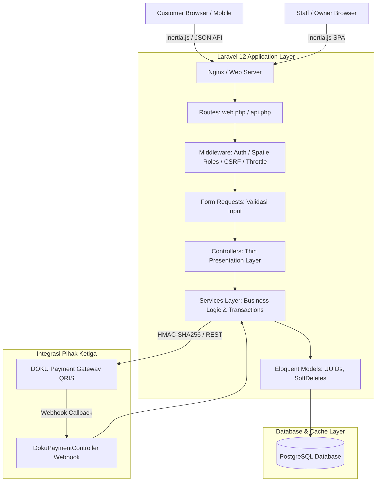
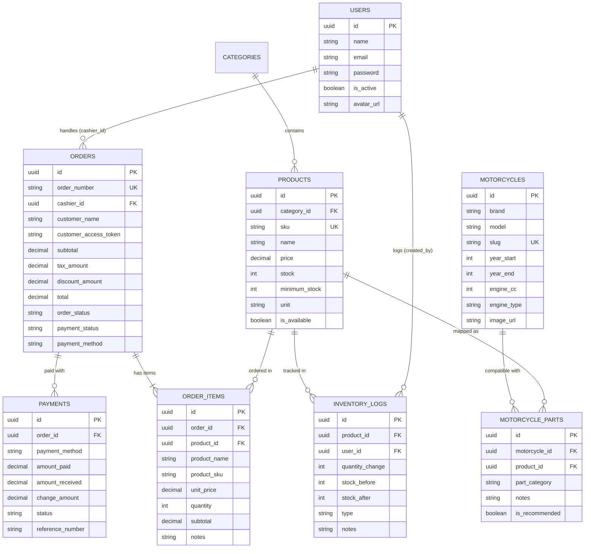
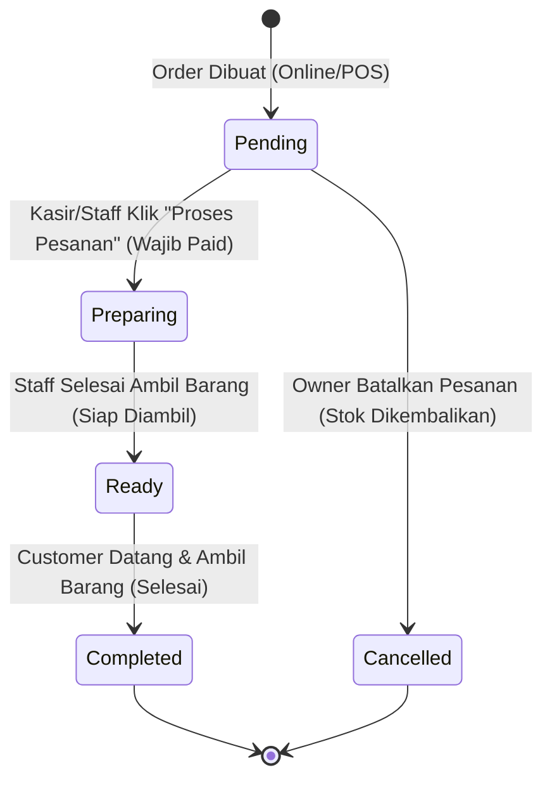
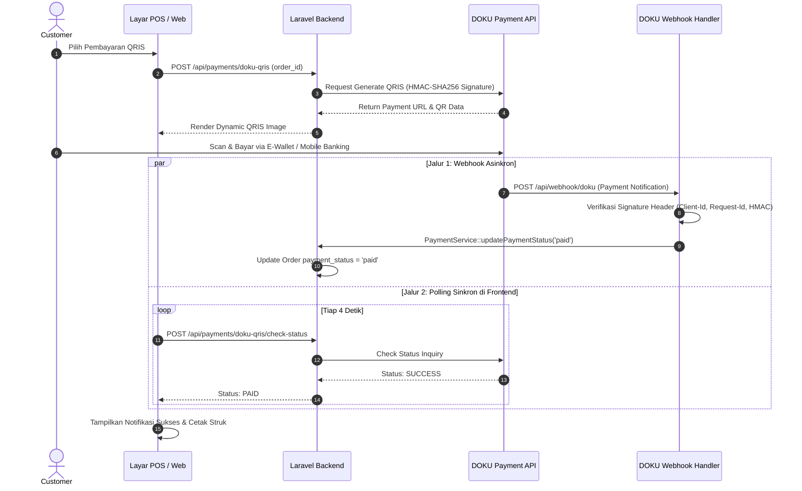

# Toko Sparepart — Master Alur Sistem & Arsitektur Lengkap (Comprehensive System Flow)

> **Dokumen Arsitektur & Alur Kerja Lengkap Toko Sparepart**  
> Sistem manajemen toko sparepart modern berbasis web dengan dukungan **Omnichannel Pre-Order (QR Self-Order)**, **Katalog Kompatibilitas Motor (Fitment Engine - "Motor Saya")**, **Point of Sale (POS) Kasir Cepat**, **Manajemen Inventaris & Audit Trail Otomatis**, serta **Integrasi Payment Gateway DOKU QRIS & Kasir**.

---

## DAFTAR ISI
1. [Ringkasan Arsitektur & Tech Stack](#1-ringkasan-arsitektur--tech-stack)
2. [Role & Hak Akses (Role-Based Access Control)](#2-role--hak-akses-role-based-access-control)
3. [Model Database & Relasi Entitas](#3-model-database--relasi-entitas)
4. [Alur Kerja Lengkap (End-to-End User Journeys)](#4-alur-kerja-lengkap-end-to-end-user-journeys)
   - [4.1 Alur Customer: Pre-Order Online via QR Katalog](#41-alur-customer-pre-order-online-via-qr-katalog)
   - [4.2 Alur Customer: Fitment Engine "Motor Saya"](#42-alur-customer-fitment-engine-motor-saya)
   - [4.3 Alur Kasir: Penjualan Langsung via POS (Point of Sale)](#43-alur-kasir-penjualan-langsung-via-pos-point-of-sale)
   - [4.4 Alur Pemenuhan Pesanan (Order Fulfillment Lifecycle)](#44-alur-pemenuhan-pesanan-order-fulfillment-lifecycle)
   - [4.5 Alur Manajemen Motor & Mapping Sparepart (Fitment Management)](#45-alur-manajemen-motor--mapping-sparepart-fitment-management)
   - [4.6 Alur Inventaris, Stock Adjustment & Audit Trail](#46-alur-inventaris-stock-adjustment--audit-trail)
   - [4.7 Alur Laporan & Analytics Owner](#47-alur-laporan--analytics-owner)
5. [Mesin Status (State Machine) & Aturan Bisnis (Business Guards)](#5-mesin-status-state-machine--aturan-bisnis-business-guards)
6. [Arsitektur Pembayaran (Payment Gateway & Cash Flow)](#6-arsitektur-pembayaran-payment-gateway--cash-flow)
7. [Matriks Endpoint API & Validasi Form Requests](#7-matriks-endpoint-api--validasi-form-requests)
8. [Mekanisme Keamanan, Konkurensi & Integritas Data](#8-mekanisme-keamanan-konkurensi--integritas-data)

---

## 1. Ringkasan Arsitektur & Tech Stack



- **Backend**: Laravel 12 (PHP 8.2+) dengan pola arsitektur **Controller → Service → Model**. Seluruh aturan bisnis, kalkulasi harga/pajak, transaksi database, dan mutasi stok diisolasi di `app/Services/`.
- **Database**: PostgreSQL dengan primary key UUID (`HasUuids`), Soft Deletes pada entitas utama (`Product`, `Order`, `Motorcycle`, `Category`), dan indeks komprehensif pada kolom pencarian dan filtering tanggal.
- **Frontend**: Single Page Application (SPA) monolitik modern menggunakan **Inertia.js** + **React 19** + **Vite** + **Tailwind CSS**.
- **State & UI**: Ikon Feather (`react-icons/fi`) dan Game Icons (`react-icons/gi`), auto-refresh reactive state, responsive mobile-first untuk customer dan desktop-optimized untuk POS kasir.

---

## 2. Role & Hak Akses (Role-Based Access Control)

Sistem menggunakan `spatie/laravel-permission` dengan 2 role utama:

| Fitur / Modul | Owner (`owner`) | Kasir (`cashier`) | Customer (Publik / Guest) |
|---|:---:|:---:|:---:|
| **Redirect Setelah Login** | `/dashboard` | `/pos` | N/A |
| **Katalog QR & Pre-order (`/`)** | ✓ | ✓ | ✓ (Tanpa login) |
| **Pencari Part "Motor Saya" (`/motor-saya`)** | ✓ | ✓ | ✓ (Tanpa login) |
| **Tracking Pesanan (`/order/status`)** | ✓ | ✓ | ✓ (Via Customer Token) |
| **POS Kasir (`/pos`)** | ✓ | ✓ | ✗ |
| **Daftar & Status Pesanan (`/orders`)** | ✓ | ✓ | ✗ |
| **Pembayaran Pesanan (Cash/QRIS/Debit)** | ✓ | ✓ | ✗ |
| **Katalog Sparepart (`/products`)** | Read & Write (CRUD) | Read Only (Lihat & Cari) | ✗ |
| **Data Motor & Mapping (`/motorcycles`)** | Read & Write (CRUD) | Read Only | ✗ |
| **Inventaris & Audit Stok (`/inventory`)** | Read & Write (Penyesuaian) | ✗ | ✗ |
| **Dashboard KPI & Statistik (`/dashboard`)** | ✓ | ✗ | ✗ |
| **Laporan Penjualan & Print (`/reports`)** | ✓ | ✗ | ✗ |
| **Kelola Staff & User (`/users`)** | ✓ (Minimal 1 Owner Aktif) | ✗ | ✗ |
| **Pengaturan Toko & Pajak (`/settings`)** | ✓ | ✗ | ✗ |
| **Reset Transaksi** | ✓ (Wajib Verifikasi Password) | ✗ | ✗ |

---

## 3. Model Database & Relasi Entitas



---

## 4. Alur Kerja Lengkap (End-to-End User Journeys)

### 4.1 Alur Customer: Pre-Order Online via QR Katalog

```
[ Customer Scan QR di Meja / Banner ]
                │
                ▼
      Halaman Katalog (/)
   ├── Filter Kategori Sparepart
   ├── Filter Kompatibilitas Motor (Brand / Model)
   └── Cari Nama / SKU Produk
                │
                ▼
   [ Masukkan ke Keranjang ]
   ├── Atur Quantity (Max 200 unit/item, Max 20 item)
   └── Tambahkan Catatan Khusus
                │
                ▼
  [ Checkout / Pembayaran (/payment) ]
   ├── Isi Nama Pelanggan (Wajib)
   └── Pilih Metode:
         ├── A. Bayar QRIS (DOKU Online)
         └── B. Bayar di Kasir (Offline)
                │
                ▼
  POST /api/customer/order (Database Transaction + lockForUpdate)
   ├── Validasi ketersediaan & stok barang
   ├── Buat nomor pesanan (ORD-YYYYMMDD-XXXX)
   ├── Kurangi stok & catat InventoryLog (SALE)
   └── Generate customer_access_token unik (64 char)
                │
                ▼
  [ Halaman Status Pesanan (/order/status) ]
   ├── Polling status berkala tiap 5 detik
   ├── Tampilkan QRIS / Kode Bayar
   └── Status berubah real-time:
         Menunggu Bayar ──► Disiapkan ──► Siap Diambil (Notifikasi)
                │
                ▼
  [ Customer Datang ke Toko & Ambil Barang Tanpa Antre ]
```

---

### 4.2 Alur Customer: Fitment Engine "Motor Saya"

1. Customer membuka rute `/motor-saya`.
2. Customer memilih **Brand** (Honda, Yamaha, Suzuki, Kawasaki).
3. Customer memilih **Model & Varian Motor** (misal: *Honda Beat ESP 110cc (2020-sekarang)*).
4. Sistem memanggil `GET /api/motor-saya/{motorcycleId}/parts`.
5. Halaman menampilkan sparepart yang **100% kompatibel**, terkelompok rapi per sistem motor:
   - **Pelumas & Cairan**: Oli Mesin, Oli Gardan, Air Radiator, Minyak Rem.
   - **Kaki-kaki & Roda**: Ban Luar/Dalam Depan/Belakang, Bearing Roda, Shockbreaker.
   - **Pengereman**: Kampas Rem Depan/Belakang, Piringan Cakram, Master Rem.
   - **Penggerak & Transmisi**: V-Belt CVT, Roller, Kampas Ganda, Gear Set & Rantai.
   - **Kelistrikan & Pengapian**: Busi, Aki, Kiprok, CDI/ECU, Koil.
   - **Mesin & Filter**: Filter Udara, Filter Oli, Piston Kit, Noken As.
6. Customer dapat langsung memasukkan sparepart yang tepat ke keranjang tanpa takut salah beli.

---

### 4.3 Alur Kasir: Penjualan Langsung via POS (Point of Sale)

```
[ Kasir Buka Layar POS (/pos) ] (Shortcut Keyboard: F1, F2, F8)
                │
                ▼
   [ Cari & Pilih Produk ]
   ├── Barcode / SKU Scan
   ├── Pencarian Cepat Nama Sparepart
   └── Filter Tipe Motor Pelanggan
                │
                ▼
   [ Keranjang Transaksi ]
   ├── Ubah jumlah qty
   └── Tambah diskon transaksi (opsional)
                │
                ▼
   [ Modal Pembayaran ]
   ├── Opsi 1: TUNAI
   │     ├── Masukkan uang diterima (amount_received)
   │     ├── Sistem menghitung uang kembalian (change_amount)
   │     └── Klik "Bayar Tunai" ──► Order langsung 'completed' & 'paid'
   │
   ├── Opsi 2: QRIS DOKU DITAMPILKAN DI LAYAR KASIR
   │     ├── Kasir klik "Generate QRIS"
   │     ├── Sistem panggil API DOKU & render dynamic QR code di layar POS
   │     ├── Customer scan QR dengan GoPay/OVO/BCA/ShopeePay/dana
   │     ├── POS otomatis polling status per 4 detik
   │     └── Begitu customer bayar di HP ──► POS otomatis konfirmasi Lunas!
   │
   └── Opsi 3: DEBIT / TRANSFER MANUAL
         └── Masukkan nomor referensi EDC / Bank ──► Transaksi Lunas
                │
                ▼
   [ Cetak Struk Thermal 58mm / 80mm Otomatis ]
```

---

### 4.4 Alur Pemenuhan Pesanan (Order Fulfillment Lifecycle)



#### Aturan Guard pada Transisi Pesanan:
- **Lunas Sebelum Disiapkan**: Backend `OrderService::updateOrderStatus` menolak perubahan ke `preparing`, `ready`, atau `completed` jika status pembayaran masih `unpaid`.
- **Hak Pembatalan**: Hanya user dengan role `owner` yang berhak membatalkan (`cancelled`) pesanan, dan hanya bisa dilakukan saat status masih `pending`.
- **Pengembalian Stok Otomatis**: Saat pesanan di-cancel, seluruh item pesanan dikembalikan ke inventaris produk secara otomatis melalui `InventoryService` dengan log audit `type = 'RETURN'`.

---

### 4.5 Alur Manajemen Motor & Mapping Sparepart (Fitment Management)

1. Owner/Staff membuka menu **Data Motor** (`/motorcycles`).
2. **Tambah / Edit Model Motor**:
   - Validasi via `StoreMotorcycleRequest` / `UpdateMotorcycleRequest`.
   - Input Brand, Model, Tahun Mulai, Tahun Akhir, CC Mesin, Tipe Mesin (Matic/Bebek/Sport), dan Foto.
   - Slug unik dibuat otomatis (misal: `honda-beat-110-2020`).
3. **Mapping Sparepart Kompatibel per Model**:
   - Klik kartu motor untuk membuka panel detail.
   - Klik **"Tambah Part Baru"** (Validasi via `AttachMotorcyclePartRequest`).
   - Pilih tipe komponen dari dropdown terstruktur `<optgroup>` (*Pelumas, Kaki-kaki, Pengereman, CVT, dll*).
   - Cari & pilih produk sparepart dari katalog.
   - Masukkan catatan khusus dan opsi centang `⭐ Rekomendasi`.
   - Validasi backend mencegah mapping duplikat untuk produk yang sama pada satu motor.
4. **Navigasi & Filter Sparepart per Motor**:
   - Pencarian instan (Live Search) nama sparepart, SKU, atau catatan.
   - Filter dropdown grup kategori & tipe spesifik.
   - Toggle tombol filter `⭐ Rekomendasi`.
   - **Paginasi Sparepart** (5, 10, 20 per halaman) menjaga layout tetap ringkas dan tidak memanjang ke bawah.
5. **Edit & Hapus Mapping**:
   - Update mapping via `UpdateMotorcyclePartRequest`.
   - Hapus mapping via `DELETE /motorcycles/{motorcycleId}/parts/{partId}`.

---

### 4.6 Alur Inventaris, Stock Adjustment & Audit Trail

Setiap pergerakan fisik stok sparepart memiliki catatan mutasi permanen di tabel `inventory_logs`:

```
        MUTASI STOK (InventoryLog)
 ┌───────────────────┬────────────────────────────────────────────────────────┐
 │ Tipe Mutasi       │ Pemicu / Trigger                                       │
 ├───────────────────┼────────────────────────────────────────────────────────┤
 │ SALE              │ Pesanan baru dibuat (Customer QR / POS Kasir)          │
 │ RETURN            │ Pesanan pending dibatalkan oleh Owner                  │
 │ IN                │ Penambahan stok masuk / Restock dari Supplier          │
 │ OUT               │ Pengurangan stok rusak, hilang, atau kadaluarsa        │
 │ ADJUSTMENT        │ Stock opname fisik berkala                             │
 └───────────────────┴────────────────────────────────────────────────────────┘
```

- Penyesuaian stok di `/inventory` mencatat `stock_before`, `stock_after`, `quantity_change`, `user_id` yang bertindak, dan alasan penyesuaian.
- Log inventaris **tidak dapat dihapus via API** untuk menjaga integritas pembukuan dan mencegah manipulasi data stok.

---

### 4.7 Alur Laporan & Analytics Owner

1. **Dashboard KPI Owner (`/dashboard`)**:
   - Ringkasan pendapatan kotor hari ini, kemarin, dan bulan ini.
   - Jumlah transaksi sukses & rata-rata nilai transaksi (AOV).
   - Antrean pesanan aktif (`pending`, `preparing`, `ready`).
   - Widget peringatan stok menipis (`stock <= minimum_stock`).
   - Grafik breakdown penjualan per jam & daftar produk terlaris (*Top Selling Spareparts*).
2. **Laporan Penjualan (`/reports`)**:
   - Filter berdasarkan rentang tanggal fleksibel (Hari ini, 7 hari terakhir, 30 hari, kustom).
   - Ringkasan total penjualan, potongan diskon, pajak terkumpul, dan pendapatan bersih.
   - Tabel rincian per transaksi lengkap dengan nama customer, kasir, metode pembayaran, dan status.
   - Format siap cetak (Printable View) yang bersih untuk arsip fisik pembukuan.

---

## 5. Mesin Status (State Machine) & Aturan Bisnis (Business Guards)

### 5.1 Matriks Transisi Status Pesanan (`order_status`)

| Status Awal | Status Tujuan yang Diizinkan | Syarat & Kondisi |
|---|---|---|
| `pending` | `preparing` | Status pembayaran harus `paid` |
| `pending` | `cancelled` | Hanya role `owner` (Stok dikembalikan otomatis) |
| `preparing` | `ready` | Pesanan selesai disiapkan oleh staf toko |
| `ready` | `completed` | Barang telah diserahkan kepada customer |
| `completed` | *Final (Tidak bisa diubah)* | Mutasi telah dicatat ke laporan keuangan |
| `cancelled` | *Final (Tidak bisa diubah)* | Transaksi batal permanen |

### 5.2 Matriks Transisi Status Pembayaran (`payment_status`)

```
unpaid ──► pending (Menunggu respon QRIS DOKU) ──► paid (Lunas)
   │                                                   ▲
   └───────────────────────────────────────────────────┘ (Bayar Tunai di Kasir)
```

- **Idempotency Guard**: Jika order sudah berstatus `paid`, request pembayaran ulang akan ditolak oleh sistem untuk mencegah double ledger entry.
- **DOKU Pending Invalidation**: Saat kasir atau customer me-regenerate QRIS baru, invoice DOKU pending sebelumnya otomatis dibatalkan di backend untuk mencegah double charge.

---

## 6. Arsitektur Pembayaran (Payment Gateway & Cash Flow)



---

## 7. Matriks Endpoint API & Validasi Form Requests

### 7.1 Rute Autentikasi & Manajemen Staff
| Method | URI | Handler | Middleware / Role | Form Request / Validasi |
|---|---|---|---|---|
| `POST` | `/login` | `AuthenticatedSessionController@store` | `guest` | `LoginRequest` |
| `POST` | `/logout` | `AuthenticatedSessionController@destroy` | `auth` | Session Token |
| `GET` | `/users` | `UserController@indexWeb` | `role:owner` | N/A |
| `POST` | `/api/users` | `UserController@store` | `role:owner` | `StoreUserRequest` |
| `PUT` | `/api/users/{id}` | `UserController@update` | `role:owner` | `UpdateUserRequest` |
| `DELETE` | `/api/users/{id}` | `UserController@destroy` | `role:owner` | Minimum 1 owner check |

### 7.2 Rute Motor & Mapping Sparepart (Fitment)
| Method | URI | Handler | Middleware / Role | Form Request / Validasi |
|---|---|---|---|---|
| `GET` | `/motorcycles` | `MotorcycleController@indexWeb` | `auth` | N/A |
| `POST` | `/motorcycles` | `MotorcycleController@store` | `auth` | `StoreMotorcycleRequest` |
| `PUT` | `/motorcycles/{id}` | `MotorcycleController@update` | `auth` | `UpdateMotorcycleRequest` |
| `DELETE` | `/motorcycles/{id}` | `MotorcycleController@destroy` | `auth` | Cascade delete mapping |
| `GET` | `/motorcycles/{id}/parts` | `MotorcycleController@parts` | `auth` | `GetMotorcyclePartsRequest` |
| `POST` | `/motorcycles/{id}/parts` | `MotorcycleController@attachPart` | `auth` | `AttachMotorcyclePartRequest` |
| `PUT` | `/motorcycles/{id}/parts/{partId}` | `MotorcycleController@updatePart` | `auth` | `UpdateMotorcyclePartRequest` |
| `DELETE` | `/motorcycles/{id}/parts/{partId}` | `MotorcycleController@detachPart` | `auth` | Find & delete mapping |
| `GET` | `/motor-saya` | `MotorSayaController@index` | Publik | N/A |
| `GET` | `/api/motor-saya/{id}/parts` | `MotorSayaController@compatibleParts` | Publik | Grouped categories |

### 7.3 Rute Pesanan & Penjualan (Orders & POS)
| Method | URI | Handler | Middleware / Role | Form Request / Validasi |
|---|---|---|---|---|
| `POST` | `/api/customer/order` | `CustomerMenuController@storeOrder` | Throttle (120/min) | `StoreCustomerOrderRequest` |
| `GET` | `/api/customer/order/{id}/status` | `CustomerMenuController@orderStatus` | Throttle (240/min) | Customer Access Token |
| `GET` | `/orders` | `OrderController@indexWeb` | `role:owner\|cashier` | Status & search filter |
| `POST` | `/api/orders` | `OrderController@store` | `role:owner\|cashier` | `StoreOrderRequest` |
| `PATCH` | `/api/orders/{id}/status` | `OrderController@updateStatus` | `role:owner\|cashier` | `UpdateOrderStatusRequest` |
| `POST` | `/api/orders/{id}/cancel` | `OrderController@cancel` | `role:owner` | Pending status only |

### 7.4 Rute Pembayaran & DOKU Gateway
| Method | URI | Handler | Middleware / Role | Form Request / Validasi |
|---|---|---|---|---|
| `POST` | `/api/payments` | `PaymentController@store` | `role:owner\|cashier` | `StorePaymentRequest` |
| `POST` | `/api/payments/doku-qris` | `DokuPaymentController@generatePosQris` | `role:owner\|cashier` | Order ID exists |
| `POST` | `/api/payments/doku-qris/check-status` | `DokuPaymentController@checkPosStatus` | `role:owner\|cashier` | Order ID exists |
| `POST` | `/api/customer/payment/qris` | `DokuPaymentController@createQrisPayment` | Throttle (60/min) | Customer token check |
| `POST` | `/api/webhook/doku` | `DokuPaymentController@handleWebhook` | Public (No CSRF) | DOKU HMAC Signature |

---

## 8. Mekanisme Keamanan, Konkurensi & Integritas Data

1. **Pessimistic Concurrency Locking (`lockForUpdate`)**:
   - Pada saat checkout pesanan (`OrderService::createOrder`), baris database produk di-lock secara eksklusif dalam database transaction hingga stok diverifikasi dan didekremen. Hal ini menjamin tidak terjadi *race condition* atau *overselling* saat beberapa customer/kasir membeli stok produk terakhir secara bersamaan.
2. **CSRF & Session Protection**:
   - Semua rute administratif dan operasional staf dilindungi oleh token CSRF.
   - Rute publik yang memerlukan pengecualian CSRF (seperti webhook DOKU) diverifikasi menggunakan algoritma kriptografi HMAC-SHA256 berdasarkan Secret Key toko.
3. **Payload Sanitization & Rate Limiting (Throttling)**:
   - Endpoint order publik dibatasi maksimal 20 item per pesanan dan maksimal 200 unit per item.
   - Throttling ketat diterapkan pada seluruh rute publik untuk mencegah brute-force atau scraping bot.
4. **Soft Deletes & Audit Trails**:
   - Entitas bisnis vital (`Product`, `Category`, `Motorcycle`, `Order`) menggunakan soft deletes untuk mencegah hilangnya riwayat transaksi masa lalu.
   - Mutasi stok selalu menghasilkan baris log di `inventory_logs` dengan pencatatan user yang bertindak.
5. **Konfirmasi Tindakan Kritis (Password Confirmation)**:
   - Fitur reset transaksi mengharuskan owner memasukkan password saat ini untuk mencegah penghapusan data secara tidak sengaja.
